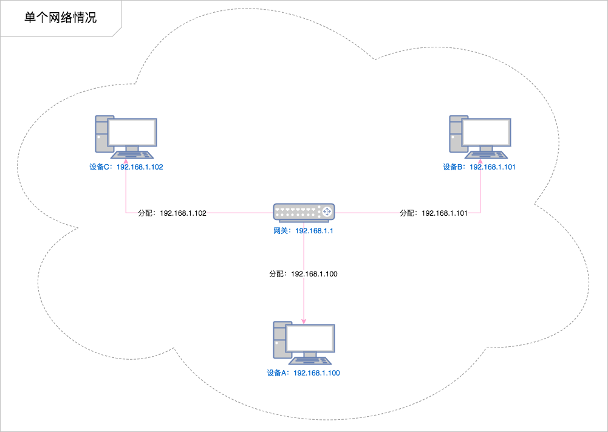
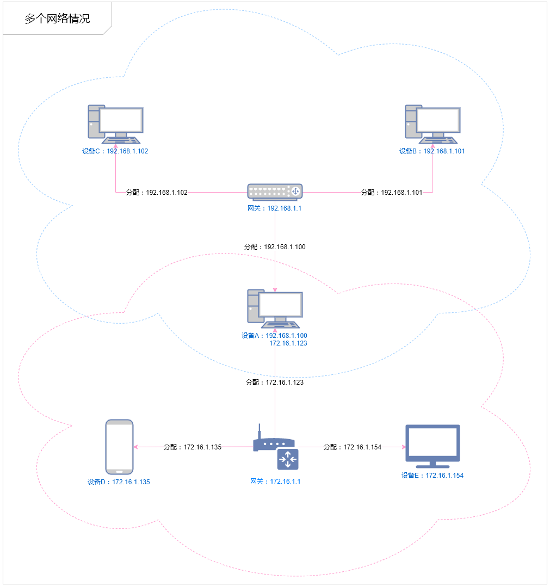
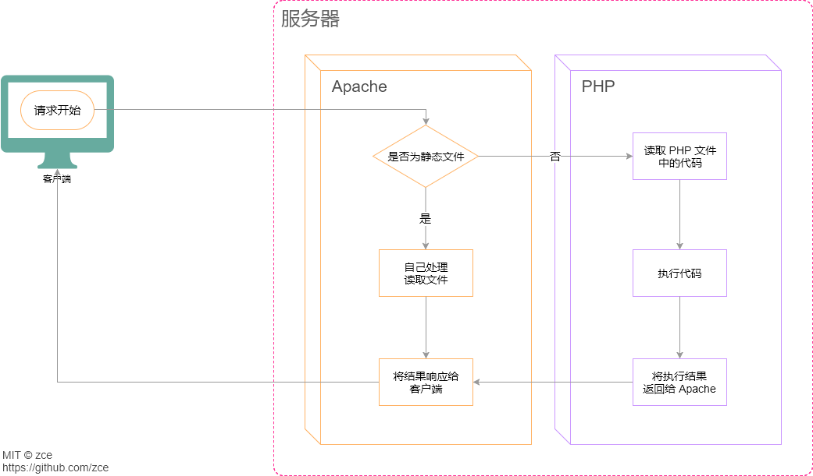

## 建立你的第一个网站（大目标）

> **前端开发** 最终还是属于 **Web 开发** 中的一个分支，想要成为一名合格的前端开发人员，就必须要 **充分理解 Web 的概念**。

构建一个专业的网站是一项巨大的工作！对于新手我们应该从小事做起，也就是说咱们不可能立马就要求自己能够开发出跟淘宝一样的电商平台，但是对咱们来说建立一个属于自己的 Blog 网站并不难（其实再大的系统也是由一些基础功能叠加出来的），所以咱们就从这个话题开始聊。

## 如何建立一个 Blog 网站

> 提问：到底什么是网站？
>
> - 可以在浏览器上通过一个地址直接访问使用
> - 用于提供一种（或多种）特定服务的一系列具备相关性的网页组合的整体
> - 例如：博客、门户、电商、在线教育等

有了明确的目标过后，我们需要规划具体的业务方案，学习特定的技能，完成各项功能，解决各种过程中出现的问题。

```flow
s=>start: 开始
o1=>operation: 明确业务
o2=>operation: 根据业务分析需求
o3=>operation: 设计功能
o4=>operation: 具体实现功能
o5=>operation: 部署上线
e=>end: 结束
s->o1->o2->o3->o4->o5->e
```

### 之前学习了什么？

在之前的学习过程中，我们很专注，没有关心这些东西在整体中是什么角色，起到什么作用。这里我们是时候总结一下我们之前学过了的内容：

- 网页开发技术（硬性）
  - HTML —— 网页内容结构（GUI）
  - CSS —— 网页外观样式（GUI）
  - JavaScript —— 编程语言（**可以用于**调用浏览器提供的 API）
  - Web APIs —— 网页交互（界面功能）
  - jQuery —— 便捷手段（糖果而已，不是必要的）
- 编程能力 / 编程思想 / 解决问题的思路（软性）
  - 我要做什么（我要得到什么），我目前有什么（我能拿到什么）

至此，我们已经可以独立完成网页开发了，具体能完成的东西就是一个一个的网页，而且还能给这个页面加上一些动态的交互。但是这距离成为一个网站还有一些路要走。

```flow
webpage=>operation: 网页开发
website=>operation: 网站开发
application=>operation: 应用开发

webpage(right)->website(right)->application
```

### 还需要学习什么？

想要完成完整的 Web 网站，还需要学习什么？

- 搭建 WEB 服务器（提供网站服务的机器）
- 服务端开发（动态网页技术）
- HTTP（浏览器与服务端的通讯协议）
- 数据库操作（服务端存储数据方式）
- AJAX（浏览器与服务端的数据交互方式）

### 访问一个网站时发生了什么？(重要)


## 什么是 Web 服务器

> - 服务器（提供服务）指的就是一台**安装特定的软件的计算机**，用于专门用于提供特定的服务。
>   - 按照服务类型的不同，又划分为：Web 服务器、数据库服务器、文件服务器等等。
> - 客户端（使用服务）指的是在一次服务过程中使用这个服务的设备（网络端点）。
>   - 目前咱们最常见的客户端就是浏览器

我们手头上的这些网页，如果想要成为一个网站，首先要完成的第一件事就是有一台公共的 Web 服务器，把这一系列的页面放到这台 Web 服务器上，让用户可以通过服务器的地址访问到这些网页。


> 思考：为什么不把这些网页放在我们自己电脑上呢？

那么，哪里有这样的服务器呢？

我们手头上的电脑都可以是一台服务器，因为服务器是一个相对的概念，只要能提供服务就可以是一个服务器（提供服务的时候就是服务端，使用服务的时候就是客户端）。

既然服务器就是安装特定的软件的计算机，那么要让自己的成为 Web 服务器就是要安装一个 Web 服务器软件。

### C/S 架构与 B/S架构 (理解)

> 应用软件架构一般分为两类：
>
> - B/S 架构：Browser（浏览器） ←→ Server（服务器），这种软件都是通过浏览器访问一个网站使用，服务器提供数据存储等服务。
> - C/S 架构：Client（客户端） ←→ Server（服务器），这种软件通过安装一个软件到电脑，然后使用，服务器提供数据存储等服务。

B/S的优点与缺点：

​	优点：部署方便(不用安装)，可维护性强。

​	缺点：用户体验不好

C/S的优点与缺点：

​	优点：用户体验好

​	缺点：部署不方便(用安装)，可维护性弱	


### Web 服务器软件分类（了解）

- Nginx
- Apache  -  php
- IIS  -  C#    .net
- Tomcat  -   java

## 网络基础概念（理解）

### IP 地址

> Internet Protocol Address

设备在某一个网络中的地址，目前最常见的格式(IPV4)：`[0-255].[0-255].[0-255].[0-255]` 即为四个 0-255 的数字组成。  192.168.83.77

作用就是标识一个网络设备（计算机、手机、电视）在**某一个具体的网络**当中的地址。

127.0.0.1 是本地回环地址 localhost

#### 单个网络情况

在单个局域网下，结构非常简单，就是我们所连接的网络设备（网关）给我们分配了一个地址，在**这个范围之内**我们都可以通过这个地址找到我们的这个设备。

> 如果设备没有连接任何网络情况下，我们会有一个本地回环地址 127.0.0.1



#### 多个网络情况

但是当一个设备同时处于多个网络下（比如同时连接了有线网卡和无线网卡），就会变得稍微复杂一点：



> 例如：
>
> 小明这个同学同时报名了两个课程，在 A 班级小明是班长，所有 A 班级的同学都管他叫班长（叫班长就能找到他）。而在 B 班级小明是课代表，所有 B 班的同学都管他叫课代表（叫课代表就能找到他）。
>
> 同样的一个人在不同的环境有不同的身份，这些身份只有特定的环境才生效。

> 纸上得来终觉浅，绝知此事要躬行！多尝试，多思考才能更好的理解这个问题。

### 域名

由于 IP 地址都是没有规律的一些数字组成的，很难被人记住，不利于广泛传播，所以就有人想出来要给 IP 起名字（别名）。

> 域名是需要花钱注册的

#### 特殊的域名

`localhost` 含义为本地主机，对应127.0.0.1 。这是一个保留域名，主要用于本地测试。

#### 顶级域名（了解）

.com: 商业机构 
.cn: 中国国家、地区域名 .hk,
.gov: 政府网站。
.org: 机构。
.edu: 教育网站。
.net: 网络服务商。   php.net
.mil: 军事。

### DNS( domain system 域名系统)

通过宽带运营商提供的服务器解析一个域名背后对应的 IP，这个过程叫做 **DNS 寻址**，帮你完成 DNS 寻址过程的服务器叫做 **DNS 服务器**。

```
1> 在浏览器中输入一个域名时,我们的浏览器会首先在本地计算机中找寻一个 称为 hosts 的文件
2> 看看本地的 hosts 中知否存储着 域名与 ip地址 的对应关系, 如果存储这个对应关系, 那么我们就使用这个对应关系.
3> 如果本地没有这个记录, 再根据我们的 DNS 的配置找到 DNS 服务器再进行转换( 域名 -> IP地址 )
```

#### hosts 文件

操作系统在发起对 DNS 服务器的查询请求之前，会优先检查本机的 hosts 文件。如果这个文件中包含了对当前需要解析的域名的配置，则不再发起对 DNS 服务器的请求，直接使用 hosts 文件中的配置。

**文件所在路径：**

- Windows：`C:\Windows\System32\drivers\etc\hosts`
- macOS：`/etc/hosts`

> **注意：**
>
> - 本机的 hosts 文件配置只能到影响本机的 DNS 寻址
> - 只有以管理员权限运行的编辑器才有权利修改 `hosts` 文件
> - 修改时注意备份

### 端口

计算机本身是一个封闭的环境，就像是一个大楼，如果需要有数据通信往来，必须有门，这个门在术语中就叫端口，每一个端口都有一个编号，每台计算机只有 65536 个端口（0-65535）。

> 一般我们把“占门”的过程叫做监听

可以通过在命令行中运行： `netstat -an` 命令监视本机端口使用情况：


> 参考链接：
>
> - https://baike.baidu.com/item/%E6%9C%8D%E5%8A%A1%E5%99%A8%E7%AB%AF%E5%8F%A3
> - https://baike.baidu.com/item/%E7%AB%AF%E5%8F%A3
> - `http` 默认的端口 `80`
> - `https` 默认的端口是 `443`

### URL

URL（Uniform Resource Locator），统一资源定位符，通俗点来说就是表示网络当中某一个网页的完整访问地址，它具有一定的格式：

协议+主机域名+[端口号]+文件路径+[数据]+[锚点]

例如：https://itcast.cn:80/schools/students?id=18&name=zce#photo

## 请求响应流程 (重要)


1. 用户打开浏览器
2. 地址栏输入我们需要访问的网站网址（`URL`）
3. 浏览器通过  `DNS 服务器` 获取即将访问的网站  `IP 地址`
4. 浏览器发起一个对这个 IP地址的 `请求`
5. 服务端监听指定的 `端口` 的服务器软件接收到这个请求，进行相应的处理
6. 服务端将处理完的结果返回给客户端浏览器（`响应`）
7. 浏览器将服务端返回的结果呈现到界面上

### Apache 与 PHP

对于很多初学者来说，很容易把 Apache 和 PHP 混在一起 混为一谈，其实他们两者各自有各自负责的领域，各自的职责，但是我们在使用 PHP 做动态网站开发时，两者就会产生联系，具体如下：

> Apache 是根据文件的扩展名找到文件的类型，然后挨个问一下每一个模块能否处理这个类型的文件，如果这些模块都不能处理，那么 Apache 就自己处理（按照静态文件的方式处理）



> 你可以理解为：Apache 是一家没有太多能力的公司，只能处理一些简单的业务（静态网站），但是心很大想做更多的事（动态网站），所以就想到了外包，所有额外的业务都需要外包给其他程序，而 PHP 就是理解为一个专门能够处理 php 业务的外包公司

## 静态网站与动态网站

至此，我们已经可以把这些静态页面放到服务器上了，客户端也可以通过域名请求这个网站，但是对于我们来说，Apache 能够完成的事情过于简单，无外乎就是找到你请求对应的文件 → 读取文件 → 将文件内容响应给客户端浏览器（**文件原封不动的给你**）。**无法满足让网页内容动起来（随着数据动态变化）的需求。**

于是乎，就有人提出了**服务端动态网页的概念**，这种实现这种概念的技术有很多种：JSP、ASP.NET、PHP、Node 等等。

这些技术的原理就是：不再将 HTML 固定写死，每次用户请求时，动态执行一段代码，临时生成一个用户想要的 HTML 页面。


**动态网站指的也就是每次请求时服务端动态生成 HTML 返回给用户的这种网站。**

这里我们选择 PHP 作为我们了解服务端动态网页开发的技术方案，注意：**我们学习的重心不在 PHP，而是了解服务端开发，以及某些其他对前端开发有帮助的东西。**

## url转码

```

        -> 字符集
            计算机只认识数字, 而且二进制数字. 
            所谓 二进制, 十进制, 八进制, 十六进制都只是数字的一种表现形式.
            为了更好的解释后面的东西, 我们可以简单的认为计算机只认识数字( 十进制的 )

            名言: 数字 + 上下文 = 数据( 信息 )

            美国发明了 ASCII 码( 电报, 莫斯密码等类似的概念 )
                是一个数字 与 字符的 对照表
            在发明 ASCII 码的时候, 由于硬件的限制, 使用 7 个二进制位表示所有的 ASCII码
            7 个二进制位, 每一个二进制位可以有两种可能, 就有 2^7 种可能. 
            即 7 个二进制位有 2^7 个数字, 从 0 到 127, 共 128 个.
                前 31 个是不可见字符, 属于控制字符范畴(如回车和TAB 显示为空表)
                从 32 开始都后面的 127 全部是可视字符, 第 32 就是空格
                数字: 48 表示 字符 '0', 49 表示字符 '1', ..., 57 表示字符 '9'
                小写字母从 97 开始, 97 表示的是 'a', 98 表示 'b', ...
                大写字母从 65 开始, 65 表示的是 'A', 66 表示 'B', ...

            IBM 为 ASCII 码进行了扩展, 将 7 个二进制位, 扩展到 8 个二进制位, 因此 IBM 
            与 早期的 长城电脑上可以使用 256 个 ASCII 码. 

            随着计算机的普及, 英文需要修改了. 因此发明了双字节字符集. 
            两个字节可以表示 65535 个数据. 中国发明国标码( GB系列 gb2312最常用 )

            为了统一, 我们发明了 unicode 字符集, 旨在统一各个国家的字符集. 采用的 两个字节(全部字符都两个字节)由于电脑中最多使用的还是英文所以造成大量资源浪费.
            为了节约流量, 我们又 发明了 utf 系列: utf-7, utf-8(最常用,浏览器默认编码), utf-16, utf-32, ...
            在 utf-8 字符串集中, 所有与 ASCII 码重合的字符都是 一个字节, 一个简体汉字采用 3 个字节.

            结论: 汉字有多种编码方式.  url中的每一个汉字都是被编码成3个%dd格式(d为16进制数)
            例如  乱码为(传智播客) 
            https://www.baidu.com/s?ie=UTF-8&wd=%E4%BC%A0%E6%99%BA%E6%92%AD%E5%AE%A2
            
        -> JS  URL编码函数
            encodeURI(url)//常用
            encodeURICompoment(url)
            escape(url)
        -> JS  URL解码函数
            decodeURI(url)//常用
            decodeURICompoment(url)
            unescape(url)

        -> 在 PHP 中使用  以下函数url中除英文或者数字都被编码成%dd格式
        URL编码函数(将空白转换成%20 格式) 
            rawurlencode
            rawurldecode
        URL解码函数(将空白转换成+格式) 
            urlencode
            urldecode

            注意在描述网络的 url 地址的时候, 空格字符应该采用 %dd 的格式进行转码
            而 get 参数中的 空格应该使用 + 进行转码
```

